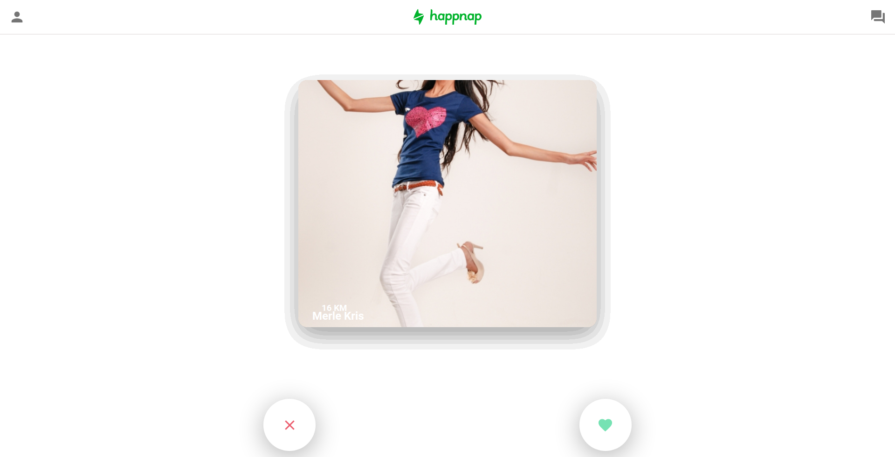

# Happnap

**Número da Lista**: 6<br>
**Conteúdo da Disciplina**: Final<br>

## Alunos

| Matrícula  | Aluno                                                        |
| ---------- | ------------------------------------------------------------ |
| 14/0156909 | [Nathalia Lorena Cardoso](https://github.com/Natilorens)     |
| 16/0006210 | [Francisco Heronildo](https://github.com/FranciscoHeronildo) |

## Sobre

Para essa entrega final, desenvolvemos um aplicativo de relacionamento baseado na localização do usuário, permitindo aos usuários curtir ou descurtir outros usuários. Nele estão presentes os algoritmos de Dijkstra e Merge Sort. No aplicativo é possível visualizar a distância mínima em Km de um usuário para outro, e também há uma ordenação dos usuários que estão mais próximos de você.

## Screenshots




## Instalação

**Linguagem**: Javascript<br>
**Framework**: ReactJS<br>
**Pré-requisitos:**<br>
&ensp; &diams; _Sistema Operacional Recomendado_: Ubuntu e derivados<br>
&ensp; &diams; [Node.js](https://nodejs.org/en/)<br>
&ensp; &diams; [ReactJS](https://reactjs.org/)<br>
&ensp; &diams; [Yarn](https://yarnpkg.com/)<br>

## Uso

Clone o Repositório:<br>

```
$ git clone https://github.com/projeto-de-algoritmos/Final_Happnap.git
```

Acesse o arquivo do projeto:<br>

```
$ cd Final_Happnap
```

Instale as dependências necessárias:<br>

```
$ yarn
```

Roda o aplicativo em modo de desenvolvimento:<br>

```
$ yarn start
```

Abra _http://localhost:3000_ para ver em seu navegador.

<!-- ## Outros

Quaisquer outras informações sobre seu projeto podem ser descritas abaixo. -->

<div align="center"><footer>&copy; Copyright </footer></div>
